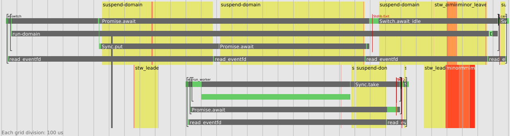

# eio-trace

eio-trace can be used to record and display traces of programs using the [Eio][] library
(requires Eio 0.14 or later).

## Installation

To install eio-trace:

```
opam install eio-trace
```

### macOS

These instructions will walk you through installing the system dependencies necessary in order to install eio-trace's dependencies from OPAM.

These instructions make use of [Homebrew](https://brew.sh/), adapt them to MacPorts, Fink, etc., if needed.

First ensure everything is up-to-date:
```sh
brew update
brew upgrade
opam update
```

Then install the required packages:
```sh
brew install bash cairo gtk+3 m4 pkg-config libffi
```

Consider restarting your terminal session at this stage.

You can now install eio-trace's dependencies.

If installing `conf-gtk3` fails with a `libffi` version error, run the following before trying again:
```sh
export PKG_CONFIG_PATH=/usr/local/Cellar/libffi/3.4.4/lib/pkgconfig
```
Update the version number to match the currently installed version of libffi.

## Tracing a program

To run an Eio program and display the trace:

```
eio-trace run -- myprog ...
```

You might like to start by tracing the example that comes with eio-trace:

```
dune build && eio-trace run -- ./_build/default/examples/net/main.exe
```

<p align='center'>
  
</p>

Scrolling with the mouse or touchpad will zoom in or out of the diagram.

To record a trace:

```
eio-trace record -f trace.fxt -- myprog ...
```

This runs `myprog ...` with the `OCAML_RUNTIME_EVENTS_START` environment variable set, which causes it to record events to a ring buffer.
eio-trace saves these events to `trace.fxt`.


The trace can be viewed using generic tools such as [Perfetto][], but eio-trace's own visualisation is more useful,
as it takes advantage of Eio's structured concurrency:

```
eio-trace show trace.fxt
```

To convert a trace to SVG format:

```
eio-trace render trace.fxt
```

You can also use `--format=png` for PNG output.

## Reading traces

Eio fibers are shown as horizontal bars.
Green regions show when the fiber is running.
Lighter-green regions highlight particular operations.
Dark grey regions indicate that the fiber is suspended (allowing other fibers to run).
Only one fiber in a domain can be running at a time.

When a new fiber is created, a vertical green line links the parent fiber to the child.

Cancellation contexts (including switches) are shown as brackets.
Switches can be named using `Switch.run ~name`. Unnamed switches are shown as "switch".
A context being cancelled is indicated by a vertical red line.

Domain-wide events, such as garbage collection and waiting for events,
are shown as yellow regions behind all the fibers in the domain.
Nested events get progressively darker yellow.
When there are multiple domains, they are shown stacked vertically:

<p align='center'>
  
</p>

In the above trace, the upper domain performed GC while suspended
(the dark "minor" region in the top right, inside the "suspend-domain" region).
This is possible because each domain has a "backup" thread that handles GC while the domain is suspended.

## Limitations

- OCaml 5.1 can [deadlock when tracing multiple domains](https://github.com/ocaml/ocaml/issues/12897). This should be fixed in OCaml 5.2.
- Events are reported per-domain, but not per-systhread.
  Events generated in systhreads will get mixed up and cannot be shown correctly.
  They will either appear attached to whatever fiber happens to be running, or shown as domain-level events.
- If events are produced too fast, some will be lost. eio-trace is unlikely to handle this well.
- The rendering is not optimised yet and may become quite slow on larger traces.

[Eio]: https://github.com/ocaml-multicore/eio
[Perfetto]: https://ui.perfetto.dev/

